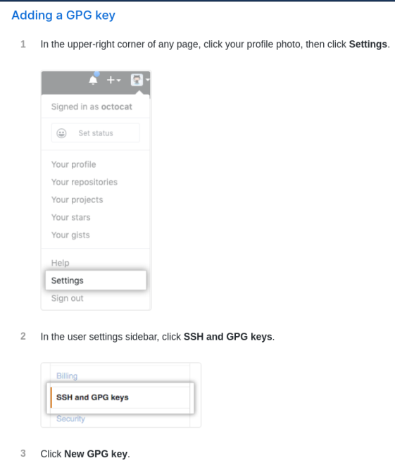
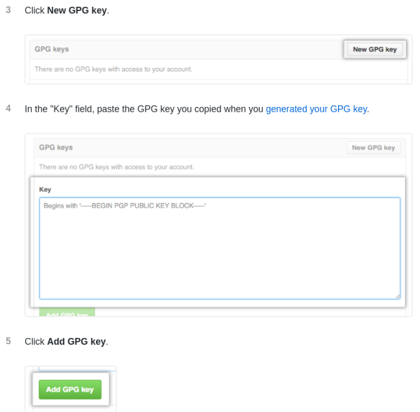

# Commit GPG signing

This guide is to add GPG signing to your commits so that your commits are verified.  
This guide will add GPG signing for all commits made on the machine, look at references for more information.  

## Table of Contents
- [1. General dependencies](#1-general-dependencies)
- [2. Guide](#2-guide)
  - [2.1. Generating a new GPG key](#21-generating-a-new-gpg-key)
  - [2.2. Looking at the GPG key](#22-looking-at-the-gpg-key)
  - [2.3. Adding your GPG Key to your github account](#23-adding-your-gpg-key-to-your-github-account)
  - [2.4. Make git sign commits](#24-make-git-sign-commits)
- [3. References](#3-references)

# 1. General dependencies
1. `gpg` (You should have this, it is default on most linux distros)

# 2. Guide

Once you have `git` and `gpg` installed, you can start.  

## 2.1. Generating a new GPG key

Use the command below to generate a new GPG RSA-4096 key:  
```zsh
$ gpg --full-generate-key
```

Here you should select:  
1. `(1) RSA and RSA (default)`
2. `4096`
3. `0`
4. For UID
   1. Email &rarr; Github's burner email
   2. Username
   3. No comment
5. Passphrase is up to you

## 2.2. Looking at the GPG key

You can then look at your GPG keys with:
```zsh
$ gpg --list-secret-keys --keyid-format LONG

# Example output (From github guide)
/Users/hubot/.gnupg/secring.gpg
------------------------------------
sec   4096R/3AA5C34371567BD2 2016-03-10 [expires: 2017-03-10]
uid                          Hubot 
ssb   4096R/42B317FD4BA89E7A 2016-03-10
```

You can then export the public key using:
```zsh
$ gpg --armor --export KEY_HERE

#Example usage
$ gpg --armor --export 3AA5C34371567BD2
```

## 2.3. Adding your GPG Key to your github account

Pictures speak a thousand words. (Also you should be able to figure this out)





## 2.4. Make git sign commits

First you need to add your key to git config:  
```zsh
$ git config --global user.signkey KEY_HERE
```

Then to add gpg signing on every commit:  
```zsh
$ git config --global commit.gpgsign true
```

Lastly if it is needed, set the program git uses to gpg sign commits:  
```zsh
$ git config --global gpg.program gpg
```

# 3. References

- [Github's main tutorial on this](https://docs.github.com/en/github/authenticating-to-github/managing-commit-signature-verification)

#### Updates

- **22/09/2020** Guide completed
- **28/09/2020** Guide moved to its own folder