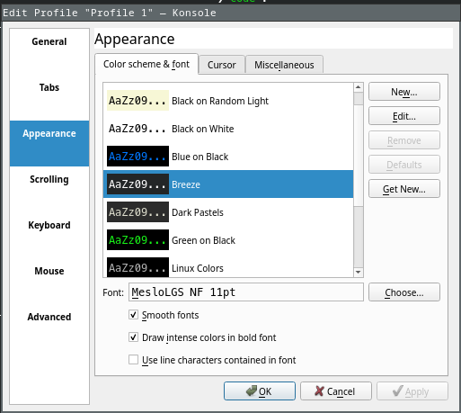
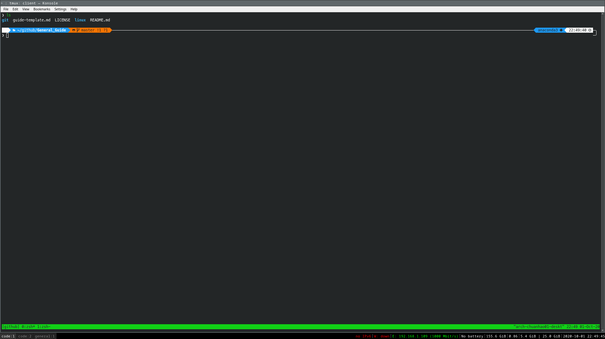

# My Terminal Setup

This guide will be on how to get my terminal setup.  
TL|DR: `I3`, `Konsole`, `Zsh`, `oh-my-zsh` and `Powerlevel10k`
 
## Table of Contents
- [1. General Dependencies](#1-general-dependencies)
- [2. Guide](#2-guide)
  - [2.1. Installing `Konsole`](#21-installing-konsole)
  - [2.2. Installing `Zsh`](#22-installing-zsh)
  - [2.3. Installing `oh-my-zsh`](#23-installing-oh-my-zsh)
  - [2.4. Installing `Powerlevel10K`](#24-installing-powerlevel10k)
- [3. Conclusion](#3-conclusion)
- [4. References](#4-references)

# 1. General Dependencies

For this guide I will assume you have `Arch Linux` (I use Arch BTW :D Had to put this in) and the desktop enviroment `I3`. (Although at this point its only a window manager)  

I might do a guide separately on `I3` in the future because that in itself takes quite a while.  

# 2. Guide

To give a bit more background for my terminal setup, I chose `Konsole`, mainly because it looked nice and had the ability to store multiple different profiles. (Maybe in the future I might pick `Alacritty`)  

I chose `Zsh`, `oh-my-zsh` and `Powerlevel10k` mainly to theme my terminal prompt. (This was long overdue, seriously if you use linux as your desktop enviroment, you need this)  

Now, without further ado, let get on with the guide

## 2.1. Installing `Konsole`  

To install `Konsole` on arch, simply use pacman.  

```bash
sudo pacman -S konsole
```

Note: Icons and such will not work yet because we do not have the entire `KDE Plasma` set. The wiki has more information.

## 2.2. Installing `Zsh`

This is also quite simple, but we do have to keep in mind to change our user's default shell after installing `Zsh`.

```bash
# Installing zsh
sudo pacman -S zsh

# Change default shell
# Note /bin/zsh is the path to your new default shell
chsh -s /bin/zsh
```

You have to logout and log back in for you to see the changes to your default shell.  

**Sidenote:**

`Zsh`, much like `Bash` uses a user and default config file.  
This file is the `.zshrc` and `.bashrc` respectively.  
They can usually be found in the home directory. (`~/`)

To get your current terminal to get/source the configs in the config files you can do:  
```bash
# For zsh
source ~/.zshrc

# In general
# Replace PATH_TO_CONFIG with the path to the config file
source PATH_TO_CONFIG
```

## 2.3. Installing `oh-my-zsh`  

For this part you should be referring to the [`oh-my-zsh`](https://github.com/ohmyzsh/ohmyzsh) github's page.  
More information can be found there.  
Below will just be the general steps needed to install `oh-my-zsh`.  

```bash
# Getting oh-my-zsh installed
sh -c "$(curl -fsSL https://raw.githubusercontent.com/ohmyzsh/ohmyzsh/master/tools/install.sh)"

# You will be promted to anwser some questions
# Usually you will use your own .zshrc config files
```

**Sidenote:**  
For me, since my `.zshrc` config files usually use some plugins, for any errors, look for the plugin on github and install them into `oh-my-zsh`.  

```bash
# Example using zsh-syntax-highlighting
git clone https://github.com/zsh-users/zsh-syntax-highlighting.git ${ZSH_CUSTOM:-~/.oh-my-zsh/custom}/plugins/zsh-syntax-highlighting
```

## 2.4. Installing `Powerlevel10K`

For this it is a little more complicated.  
Again, the repo's [github](https://github.com/romkatv/powerlevel10k) page will have more information.  

Installing the `MesloLGS NF` fonts so that `Powerlevel10k` works properly.

```bash
# Make sure to installed the patch Meslo fonts
# We are using yay because its an AUR
yay -S ttf-meslo-nerd-font-powerlevel10k
```

After this, you will have to make sure `Konsole`'s current profile you use is using the `MesloLGS NF Regular` font.  
After changing it, it should look like this:  

  

Now we will install `Powerlevel10k`.  

```bash
# Installing Powerlevel10k as a oh-my-zsh plugin
git clone --depth=1 https://github.com/romkatv/powerlevel10k.git ${ZSH_CUSTOM:-$HOME/.oh-my-zsh/custom}/themes/powerlevel10k
```

Lastly, when `Powerlevel10k` is installed, there will be some configuration that needs be done. (I will leave it to you to decide how to configure your `Powerlevel10k`)

**Sidenote:**

The config file for `Powerlevel10k` is similar to `Zsh`'s config file.  
It is usually `~/.p10k.zsh`

# 3. Conclusion

Congratulations, if you have made it to the end, your terminal should look a little something like this.  



Enjoy your new terminal theme :D.

# 4. References

- [Arch Linux](https://wiki.archlinux.org/)
- I3
  - [Arch wiki](https://wiki.archlinux.org/index.php/i3)
  - [Website](https://i3wm.org/)
- [Konsole](https://konsole.kde.org/)
- Zsh
  - [Arch wiki](https://wiki.archlinux.org/index.php/zsh)
  - [Website](https://www.zsh.org/)
- oh-my-zsh
  - [Github](https://github.com/ohmyzsh/ohmyzsh)
  - [Website](https://ohmyz.sh/)
- [Powerlevel10k](https://github.com/romkatv/powerlevel10k)

### Updates
- **02/10/2020** Guide Completed
